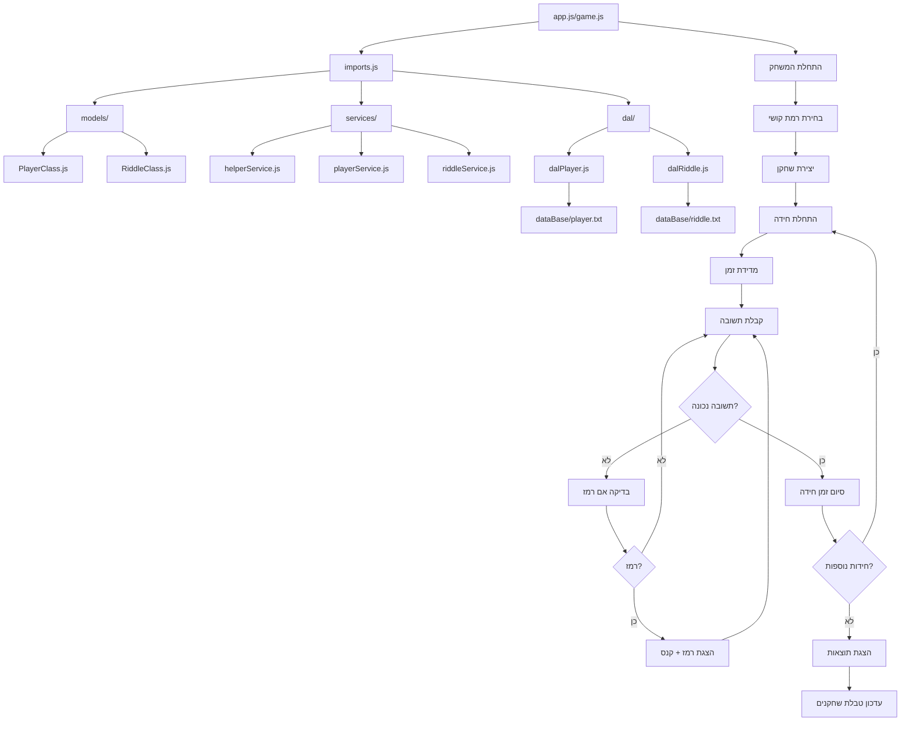

# 🧩 Riddle Project - מערכת ניהול חידות

## 📋 תוכן עניינים
- [אודות הפרויקט](#-אודות-הפרויקט)
- [תרשים זרימה](#-תרשים-זרימה)
- [מבנה הפרויקט](#-מבנה-הפרויקט)
- [התקנה והרצה](#-התקנה-והרצה)
- [מודלים](#-מודלים)
- [שירותים](#-שירותים)
- [שכבת נתונים (DAL)](#-שכבת-נתונים-dal)
- [זרימת המשחק](#-זרימת-המשחק)
- [API ופונקציות](#-api-ופונקציות)

## 🎯 אודות הפרויקט

מערכת ניהול חידות אינטראקטיבית המאפשרת:
- משחק חידות בדרגות קושי שונות (easy, medium, hard)
- מדידת זמן פתרון ושמירת תוצאות
- ניהול טבלת שחקנים מובילים
- הוספה, עריכה ומחיקה של חידות
- מערכת רמזים עם קנס זמן

## 📊 תרשים זרימה



## 🏗️ מבנה הפרויקט

```
riddle_project_2/
├── 📁 dal/                    # שכבת גישה לנתונים
│   ├── dalPlayer.js          # פעולות CRUD עבור שחקנים
│   └── dalRiddle.js          # פעולות CRUD עבור חידות
├── 📁 dataBase/              # קבצי נתונים
│   ├── player.txt            # רשימת שחקנים וניקודים
│   └── riddle.txt            # רשימת חידות
├── 📁 models/                # מודלי נתונים
│   ├── PlayerClass.js        # מחלקת שחקן
│   └── RiddleClass.js        # מחלקת חידה
├── 📁 services/              # שירותי לוגיקה עסקית
│   ├── helperService.js      # פונקציות עזר כלליות
│   ├── playerService.js      # ניהול שחקנים
│   └── riddleService.js      # ניהול חידות
├── app.js                    # נקודת כניסה ראשית
├── game.js                   # מנוע המשחק המשופר
├── imports.js                # ניהול ייבואים
└── package.json             # תלויות הפרויקט
```

## 🚀 התקנה והרצה

### דרישות מערכת
- Node.js גרסה 14 ומעלה
- npm או yarn

### התקנה
```bash
# שכפול הפרויקט
git clone [repository-url]
cd riddle_project_2

# התקנת תלויות
npm install

# הרצת המשחק
node app.js
# או
node game.js
```

## 📦 מודלים

### 👤 PlayerClass.js
```javascript
class Player {
    constructor(name)
    printTimes()  // חישוב והצגת זמנים
}
```

**מאפיינים:**
- `name`: שם השחקן
- `everegTime`: זמן ממוצע בשניות
- `times[]`: מערך זמני פתרון במילישניות

**פונקציות:**
- `printTimes()`: מחשבת סכום זמנים, ממוצע ומציגה תוצאות

### 🧩 RiddleClass.js
```javascript
class Riddle {
    constructor(riddle)
    startTime()          // התחלת מדידת זמן
    endTime(player)      // סיום מדידה וחישוב קנסים
    ask()               // הצגת חידה וקבלת תשובות
}
```

**מאפיינים:**
- `id`: מזהה חידה
- `level`: רמת קושי (easy/medium/hard)
- `name`: שם החידה
- `taskDescription`: תיאור המשימה
- `correctAnswer`: התשובה הנכונה
- `timer`: זמן מותר בשניות
- `hint`: רמז לחידה
- `start`: זמן התחלה
- `GetHint`: האם התבקש רמז
- `addTime`: זמן קנס נוסף

## 🔧 שירותים

### 🛠️ helperService.js
פונקציות עזר כלליות לניהול נתונים:

```javascript
readText()           // קריאת כל החידות
creat(obj)          // יצירת חידה חדשה
delet(id)           // מחיקת חידה לפי ID
```

### 👥 playerService.js
ניהול שחקנים וטבלת מובילים:

```javascript
readAllPlayers()                    // הצגת כל השחקנים
cheakIfPlayerInText(player)        // בדיקה אם שחקן קיים
addPlayer(player)                  // הוספת שחקן (עם בדיקת שיפור)
pushPlayer(player)                 // הכנסה למיקום מתאים בטבלה
playerMeneger(player)              // ניהול כללי של השחקן
```

**לוגיקת טבלת מובילים:**
- השחקן מוחלף רק אם השיג זמן טוב יותר
- השחקנים ממוינים לפי זמן ממוצע
- שמירה אוטומטית של השיפורים

### 🎮 riddleService.js
ניהול חידות למנהלי המערכת:

```javascript
readAllRiddles()     // הצגת כל החידות
addRiddle()         // הוספת חידה חדשה
updeatRid()         // עדכון חידה קיימת
deletRiddle()       // מחיקת חידה
```

## 💾 שכבת נתונים (DAL)

### dalPlayer.js
```javascript
readPlayer()         // קריאת קובץ שחקנים
writePlayer(players) // כתיבת נתונים לקובץ
```

### dalRiddle.js
```javascript
readRiddle()         // קריאת קובץ חידות
writeRiddle(riddles) // כתיבת נתונים לקובץ
```

## 🎲 זרימת המשחק

### 1. התחלה
```javascript
const readyRiddle = await creatRiddleObj()  // טעינת חידות
const RiddleByLevel = riddleByLevel(readyRiddle)  // סינון לפי רמה
const player = new Player(PlayerName)  // יצירת שחקן
```

### 2. לולאת משחק
```javascript
for (const riddle of arrayRiddle) {
    riddle.startTime()     // התחלת מדידה
    riddle.ask()          // הצגת חידה
    riddle.endTime(player) // סיום וחישוב ניקוד
}
```

### 3. סיום
```javascript
player.printTimes()                    // הצגת תוצאות
playerService.playerMeneger(player)    // עדכון טבלת מובילים
```

## 🎯 מערכת ניקוד וקנסים

### חישוב זמן:
- **זמן בסיסי**: זמן פתרון בפועל
- **קנס איטיות**: +5 שניות אם חריגה מהזמן המותר
- **קנס רמז**: +5 שניות אם התבקש רמז
- **זמן סופי**: זמן בסיסי + קנסים

### טבלת מובילים:
- מיון לפי זמן ממוצע (מהר יותר = טוב יותר)
- שחקן מתעדכן רק אם השיג שיפור
- שמירה אוטומטית של הישגים

## 🔐 רמות קושי

| רמה | זמן מותר | סוג חידות |
|-----|-----------|------------|
| **Easy** | 30 שניות | חשבון בסיסי |
| **Medium** | 30 שניות | אלגברה וגיאומטריה |
| **Hard** | 45 שניות | מתמטיקה מתקדמת |

## 📝 דוגמאות שימוש

### הרצת משחק:
```bash
node game.js
# > enter level: easy, medium, or hard
# > enter your name: John
# > Even Sum: What is the sum of 2 + 4 + 6?
```

### הוספת חידה:
```bash
node -e "import('./services/riddleService.js').then(s => s.addRiddle())"
```

## 🔧 תחזוקה ופיתוח

### הוספת רמת קושי חדשה:
1. עדכון קובץ `riddle.txt`
2. התאמה בפונקציה `riddleByLevel()`
3. עדכון מערכת הזמנים ב-`RiddleClass.js`

### שיפורים עתידיים:
- ממשק גרפי (GUI)
- מסד נתונים חיצוני
- מערכת רמזים מדורגת
- סטטיסטיקות מתקדמות
- מולטי-פלייר

---

💡 **טיפ**: השתמש בקובץ `game.js` במקום `app.js` לחוויית משחק משופרת עם שמירת נתונים אוטומטית!